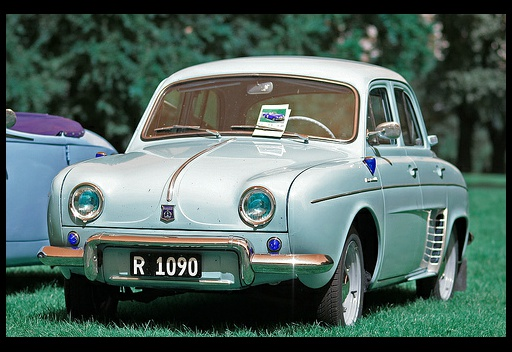

# 简介
### 数据集
使用Pascal2 VOC2012的数据中，语义分割部分的数据作为作业的数据集。

VOC网址：http://host.robots.ox.ac.uk/pascal/VOC/voc2012/

本次作业不提供数据集下载，请学员自行到上述网址找到并下载数据，同时请仔细阅读VOC网站对于数据集的描述。

VOC数据集目录结构如下：
```
├── local
│   ├── VOC2006
│   └── VOC2007
├── results
│   ├── VOC2006
│   │   └── Main
│   └── VOC2007
│       ├── Layout
│       ├── Main
│       └── Segmentation
├── VOC2007
│   ├── Annotations
│   ├── ImageSets
│   │   ├── Layout
│   │   ├── Main
│   │   └── Segmentation
│   ├── JPEGImages
│   ├── SegmentationClass
│   └── SegmentationObject
├── VOC2012
│   ├── Annotations
│   ├── ImageSets
│   │   ├── Action
│   │   ├── Layout
│   │   ├── Main
│   │   └── Segmentation
│   ├── JPEGImages
│   ├── SegmentationClass
│   └── SegmentationObject
└── VOCcode
```

数据集划分位于**VOC2012/ImageSets/Segmentation**中，分为train.txt 1464张图片和val.txt1449张图片。

语义分割标签位于**VOC2012/SegmentationClass**,注意不是数据集中所有的图片都有语义分类的标签。
语义分割标签用颜色来标志不同的物体，该数据集中共有20种不同的物体分类，以1～20的数字编号，加上编号为0的背景分类，该数据集中共有21种分类。编号与颜色的对应关系如下：
```py
# class
classes = ['background', 'aeroplane', 'bicycle', 'bird', 'boat',
           'bottle', 'bus', 'car', 'cat', 'chair', 'cow', 'diningtable',
           'dog', 'horse', 'motorbike', 'person', 'potted plant',
           'sheep', 'sofa', 'train', 'tv/monitor']

# RGB color for each class
colormap = [[0, 0, 0], [128, 0, 0], [0, 128, 0], [128, 128, 0], [0, 0, 128],
            [128, 0, 128], [0, 128, 128], [128, 128, 128], [64, 0, 0], [192, 0, 0],
            [64, 128, 0], [192, 128, 0], [64, 0, 128], [192, 0, 128],
            [64, 128, 128], [192, 128, 128], [0, 64, 0], [128, 64, 0],
            [0, 192, 0], [128, 192, 0], [0, 64, 128]]
```

对应关系可由**VOCcode/VOClabelcolormap.m**计算得出，作业代码中也有计算对应关系的代码，这里不再详述，请学员自行理解代码。

>需要注意，分类中其实还有一个编号为255的分类，其颜色对应[224, 224, 192],这个分类用作边界着色，这里不处理这个分类。

### 训练数据准备
训练数据需要预先打包成tfrecord格式。

打包使用代码中的**convert_fcn_dataset.py**脚本进行。

```
python3 convert_fcn_dataset.py --data_dir=/path/to/VOCdevkit/VOC2012/ --output_dir=./
```


本步骤最终生成的两个文件**fcn_train.record**,**fcn_val.record**分别在400MB左右，共800MB左右，如果最后的文件大小过大或过小，生成数据的过程可能有问题，请注意检查。

### 预训练模型
预训练模型使用tensorflow，modelzoo中的VGG16模型，请学员自行到modelzoo中查找并将该预训练模型放到tinymind上。


### 模型
模型参数的解释：

- checkpoint_path VGG16的预训练模型的目录，这个请根据自己建立的数据集的目录进行设置。
- output_dir 输出目录，这里使用tinymind上的/output目录即可。
- dataset_train train数据集的目录，这个请根据自己建立的数据集的目录进行设置。
- dataset_val val数据集的目录，这个请根据自己建立的数据集的目录进行设置。
- batch_size BATCH_SIZE，这里使用的是16,建立8X的FCN的时候，可能会OutOfMem，将batch_size调低即可解决。
- max_steps MAX_STEPS， 这里运行1500步，如果batch_size调整了的话，可以考虑调整一下这里。
- learning_rate 学习率，这里固定为1e-4, 不推荐做调整。

运行过程中，模型每100个step会在/output/train下生成一个checkpoint，每200步会在/output/eval下生成四张验证图片。

>FC论文参考 https://arxiv.org/abs/1411.4038


train.py中可以看到8x代码的实现。有比较明显的三个上采样过程，两个2X，一个8X，及其结果的融合。

最后的效果如下：
原图



标签


预测


CRF之后的预测


本地运行训练使用的命令行：
```sh
python train.py --checkpoint_path ./vgg_16.ckpt --output_dir ./output --dataset_train ./fcn_train.record --dataset_val ./fcn_val.record --batch_size 16 --max_steps 2000
```
